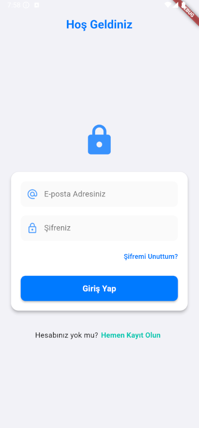
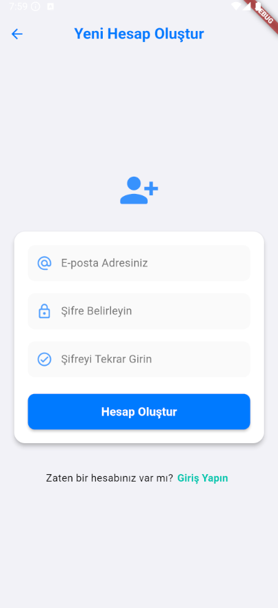
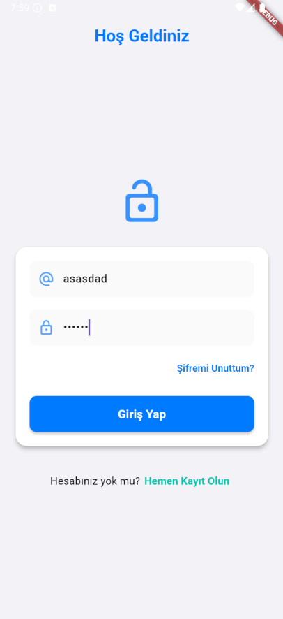

# Flutter Firebase Giriş ve Kayıt Uygulaması

Bu proje, Flutter ve Firebase kullanılarak oluşturulmuş, kullanıcı girişi ve kaydı özelliklerine sahip temel bir mobil uygulama iskeletidir.

## Ekran Görüntüleri

### Giriş Ekranı

**Form alanları boşken (kilitli ikon):**



**Form alanları doluyken (açık ikon):**



<br /> <!-- Görseller arasına ek boşluk için HTML br etiketi -->

### Kayıt Ekranı

**Yeni kullanıcı kayıt formunun görünümü:**



*(Lütfen yukarıdaki yolların projenizdeki gerçek dosya yollarıyla ve adlarıyla eşleştiğinden emin olun.)*

## Özellikler

- **Modern ve Kullanıcı Dostu Arayüz:** iOS tasarım prensiplerine uygun, renklerin psikolojik etkileri göz önünde bulundurularak tasarlanmış temiz bir arayüz.
- **Firebase Entegrasyonu:**
    - Kullanıcı Kimlik Doğrulaması (Authentication) için Firebase Auth kullanılmıştır.
    - E-posta ve şifre ile kullanıcı girişi.
    - E-posta ve şifre ile yeni kullanıcı kaydı.
- **Giriş Ekranı (`LoginPage`):
    - Şık AppBar başlığı.
    - E-posta ve şifre giriş alanları.
    - Giriş alanları dolduğunda dinamik olarak değişen (kilitli/açık) interaktif kilit ikonu.
    - "Giriş Yap" butonu ve Firebase ile iletişim sırasında yükleme göstergesi.
    - "Şifremi Unuttum?" bağlantısı (işlevsellik yakında eklenecek).
    - Kayıt ekranına yönlendirme bağlantısı.
    - Form elemanlarının `Card` içinde gruplandırılması.
- **Kayıt Ekranı (`RegistrationPage`):
    - Temiz AppBar başlığı ve geri butonu.
    - E-posta, şifre ve şifre doğrulama alanları.
    - "Hesap Oluştur" butonu ve Firebase ile iletişim sırasında yükleme göstergesi.
    - Giriş ekranına geri dönme bağlantısı.
    - Form elemanlarının `Card` içinde gruplandırılması.
- **Profesyonel Kullanıcı Deneyimi İyileştirmeleri:**
    - Başarılı ve hatalı işlemler için kullanıcıya geri bildirim sağlayan SnackBar mesajları.
    - Platforma uygun (`CircularProgressIndicator`) yükleme animasyonları.
    - Form alanları için giriş doğrulama (validation).

## Kurulum ve Çalıştırma

1.  **Flutter SDK'sının Kurulu Olduğundan Emin Olun:** [Flutter Kurulumu](https://flutter.dev/docs/get-started/install)
2.  **Projeyi Klonlayın veya İndirin:**
    ```bash
    git clone <proje_git_adresi>
    cd <proje_dizini>
    ```
3.  **Firebase Projesi Oluşturun ve Yapılandırın:**
    - [Firebase Konsolu](https://console.firebase.google.com/) adresine gidin.
    - Yeni bir proje oluşturun veya mevcut bir projeyi seçin.
    - **Android Uygulaması Ekleyin:**
        - Paket adı: `com.example.flutter_test_1` (veya `android/app/build.gradle` dosyanızdaki `applicationId` ile aynı olmalı).
        - `google-services.json` dosyasını indirin ve projenizin `android/app/` dizinine kopyalayın.
    - **iOS Uygulaması Ekleyin (İsteğe Bağlı):**
        - iOS Bundle ID: Genellikle `com.example.flutterTest1` (veya Xcode projenizdeki değer).
        - `GoogleService-Info.plist` dosyasını indirin ve Xcode kullanarak projenizin `ios/Runner/` dizinine ekleyin.
    - Firebase projenizde **Authentication** bölümüne gidin, "Sign-in method" sekmesinden **"E-posta/Şifre"** sağlayıcısını etkinleştirin.
4.  **Flutter Paketlerini Yükleyin:**
    Proje ana dizininde terminali açın ve aşağıdaki komutu çalıştırın:
    ```bash
    flutter pub get
    ```
5.  **Uygulamayı Çalıştırın:**
    Bağlı bir cihazınızın veya çalışan bir emülatör/simülatörün olduğundan emin olun.
    ```bash
    flutter run
    ```

## Kullanılan Temel Paketler

- `flutter/material.dart`: Flutter'ın Material Design widget'ları.
- `firebase_core`: Firebase'i Flutter uygulamanızda başlatmak için temel paket.
- `firebase_auth`: Firebase Authentication (kimlik doğrulama) servislerini kullanmak için.

## Gelecekteki Olası Geliştirmeler

- "Şifremi Unuttum?" işlevselliğinin tamamlanması.
- Google, Apple vb. sosyal medya hesapları ile giriş (OAuth).
- Kullanıcı profili sayfası.
- Giriş sonrası yönlendirilecek ana sayfa (Homepage).
- Daha gelişmiş state management çözümleri (Provider, BLoC vb.).
- Veritabanı (Firestore veya Realtime Database) entegrasyonu.

---

Bu README dosyası, projenin mevcut durumunu yansıtmaktadır ve geliştirme devam ettikçe güncellenebilir.
